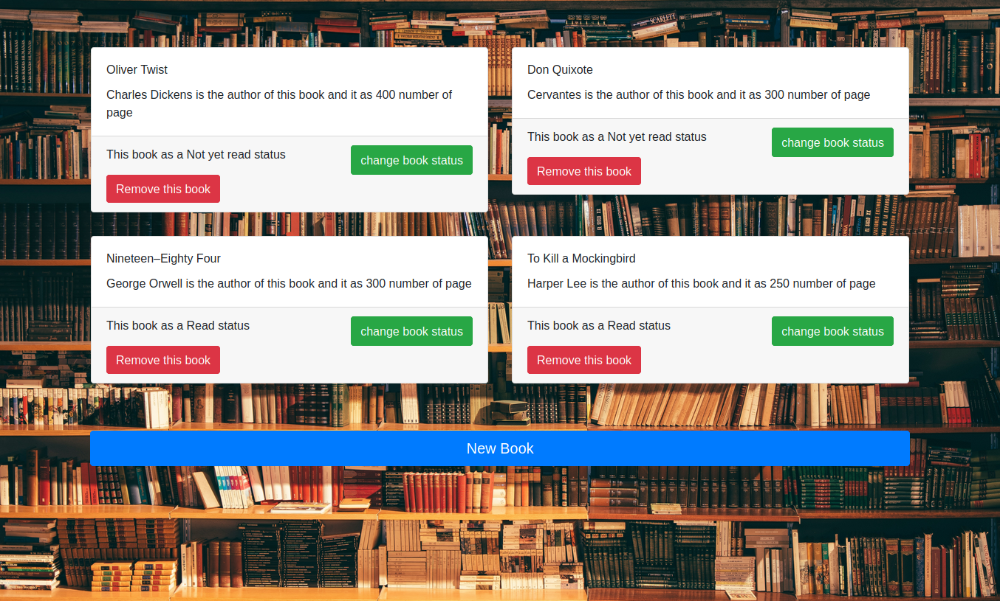

# Javascript Library

> This is part of the Library Project in [The Odin Project's](https://www.theodinproject.com/courses/javascript/lessons/library) Javascript Curriculum.

 View the app live [here](https://ozovalihasan.github.io/library/)
 
## Built With

- Javascript, HTML and CSS

## Getting Started

To get a local copy up and running follow these simple example steps.

- Clone the repository on your local machine
- cd into the folder

### Prerequisites

- Get a browser like Chrome and Firefox in their most recent versions

### Install

- Install VSCode or any code editor you like

# Authors

👤 **Somoye**

- Github:[@somoye123](https://github.com/somoye123)
- Twitter:[@ayotunde_197](https://twitter.com/ayotunde_197)
- LinkedIn:[Somoye Ayotunde](https://www.linkedin.com/in/somoye-ayotunde-03a471161)
- Mail: [somoye.ayotunde@gmail.com](somoye.ayotunde@gmail.com)

👤 **Hasan Özovalı**

- Github: [@ozovalihasan](https://github.com/ozovalihasan)
- Twitter: [@ozovalihasan](https://twitter.com/ozovalihasan)
- LinkedIn: [Hasan Ozovali](https://www.linkedin.com/in/hasan-ozovali/)
- Mail: [ozovalihasan@gmail.com](ozovalihasan@gmail.com)

## 🤝 Contributing

Contributions, issues and feature requests are welcome!

Feel free to check the [issues page](https://github.com/ozovalihasan/library/issues).

## Show your support

Give a ⭐️ if you like this project!
